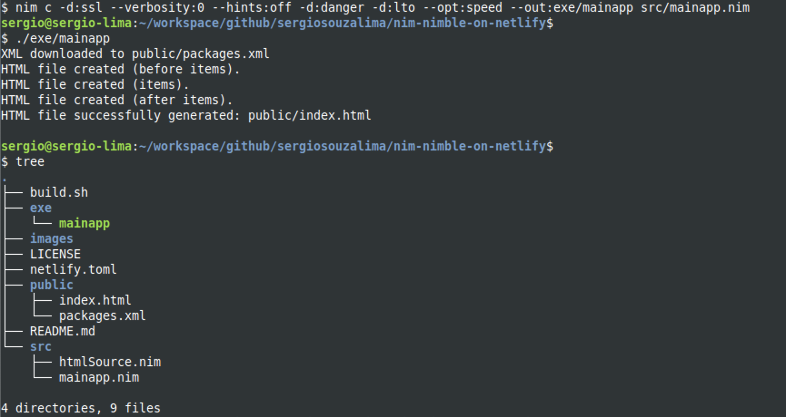

<div id="top"></div>
<!--
*** Thanks for checking out this README file.
*** If you have a suggestion, please fork the repo and create a pull request
*** or open an issue with the tag "enhancement".
*** Don't forget to give the project a star!
*** Thank you!
-->

<div align="center">
<h3 align="center">Nimble Packages Directory Project</h3>
  <p align="center">
    Web Page based on <a href="https://nimble.directory/packages.xml">Nimble packages Directory</a>. Hosted on <a href="https://www.netlify.com">Netlify</a>
    <br />
    <a href="https://github.com/sergiosouzalima/nim-nimble-on-netlify">
    <strong>Explore the docs »</strong></a>
    <br />
    <br />
    <a href="https://github.com/sergiosouzalima/nim-nimble-on-netlify/issues">Report Bug</a>
    ·
    <a href="https://github.com/sergiosouzalima/nim-nimble-on-netlify/issues">Request Feature</a>
  </p>
</div>

<!-- TABLE OF CONTENTS -->
<details>
  <summary>Table of Contents</summary>
  <ol>
    <li>
      <a href="#about-the-project">About The Project</a>
      <ul>
        <li><a href="#built-with">Built With</a></li>
      </ul>
    </li>
    <li>
      <a href="#getting-started">Getting Started</a>
      <ul>
        <li><a href="#prerequisites">Prerequisites</a></li>
        <li><a href="#installation">Installation</a></li>
      </ul>
    </li>
    <li><a href="#usage">Usage</a></li>
    <li><a href="#contributing">Contributing</a></li>
    <li><a href="#license">License</a></li>
    <li><a href="#contact">Contact</a></li>
    <li><a href="#acknowledgments">Acknowledgments</a></li>
  </ol>
</details>

<!-- ABOUT THE PROJECT -->
## About The Project

<!-- About the project image -->
<br />
<div align="center">
  <a href="https://github.com/sergiosouzalima/nim-nimble-on-netlify">
    
  </a>
</div>

<p align="right">(<a href="#top">back to top</a>)</p>

### Built With

* [Nim Language version 1.6.6](https://nim-lang.org/)

<p align="right">(<a href="#top">back to top</a>)</p>

<!-- GETTING STARTED -->
## Getting Started

See below instructions on setting up your project locally.<br />
To get a local copy up and running follow these simple steps.

### Prerequisites

Things you need to use and how to install them.

### Installation

1. Get and install Nim for Linux/MacOS:
	* https://nim-lang.org/install_unix.html
2. Get and install Nim for Windows:
	*  https://nim-lang.org/install_windows.html

<p align="right">(<a href="#top">back to top</a>)</p>

<!-- USAGE EXAMPLES -->
## Usage

How this project can be used.

1. Get Nim installed locally [<a href="#installation">See Installation section</a>]

3. Clone the repo
   ```sh
   git clone https://github.com/sergiosouzalima/nim-nimble-on-netlify.git
   ```
4. Cd into nim-nimble-on-netlify folder
   ```sh
   cd nim-nimble-on-netlify
   ```
5. Compile source code
   ```sh
   nim c -d:ssl --verbosity:0 --hints:off -d:danger -d:lto --opt:speed --out:exe/mainapp src/mainapp.nim
   ```
6. Run nimapp. This command creates public/index.html
   ```sh
   ./exe/nimapp
   ```
7. In your browser, load file public/index.html
   ```sh
   index.html
   ```

<p align="right">(<a href="#top">back to top</a>)</p>

<!-- CONTRIBUTING -->
## Contributing

Contributions are what make the open source community such an amazing place to learn, inspire, and create. Any contributions you make are **greatly appreciated**.

If you have a suggestion that would make this better, please fork the repo and create a pull request. You can also simply open an issue with the tag "enhancement".
Don't forget to give the project a star! Thanks again!

1. Fork the Project
2. Create your Feature Branch (`git checkout -b feature/AmazingFeature`)
3. Commit your Changes (`git commit -m 'Add some AmazingFeature'`)
4. Push to the Branch (`git push origin feature/AmazingFeature`)
5. Open a Pull Request

<p align="right">(<a href="#top">back to top</a>)</p>

<!-- LICENSE -->
## License

Distributed under the MIT License.

<p align="right">(<a href="#top">back to top</a>)</p>

<!-- CONTACT -->
## Contact

Sergio Lima - [@sergiosouzalima](https://twitter.com/sergiosouzalima) - sergiosouzalima@gmail.com

Project Link: [https://github.com/sergiosouzalima/nim-nimble-on-netlify](https://github.com/sergiosouzalima/nim-nimble-on-netlify)

<p align="right">(<a href="#top">back to top</a>)</p>

<!-- ACKNOWLEDGMENTS -->
## Acknowledgments

* [https://forum.nim-lang.org](https://forum.nim-lang.org)
* [Nim Lang Brazil on Telegram](https://t.me/nimbrasil)
* [nim-tutorials](https://github.com/JonathanTurnock/nim-tutorials)
* [This README template by Othneil Drew](https://github.com/othneildrew/Best-README-Template)

<p align="right">(<a href="#top">back to top</a>)</p>
